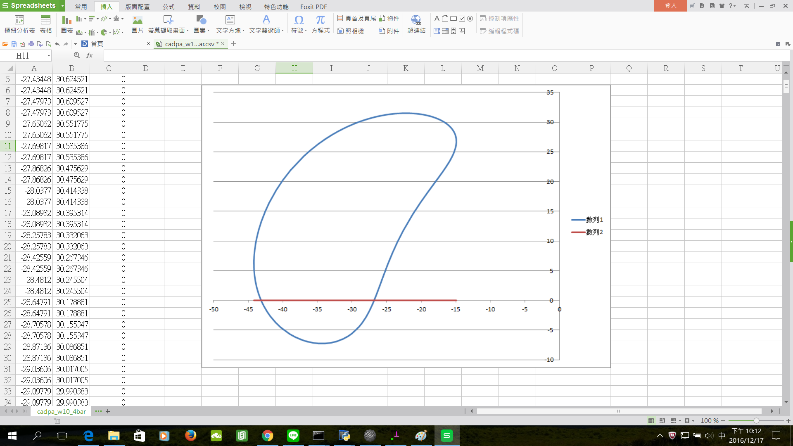

Title: Week 10
Date: 2016-11-18 22:00
Category: Misc
Tags: 使用導引, 創造力, 表達能力, 協同設計
Author: 40423225

上課內容

<!-- PELICAN_END_SUMMARY -->

有關 Solvespace 機構模擬功能介紹, 與 Python3 及 Brython 程式驗證

路徑圖

將所得到的點座標 .csv 以 Excel 畫圖。路徑圖

心得

今天第十次上課，這次上課開始教畫圖的東西，所以我學到了如何使用Solvespace，但我也要學英文，因為都看不太懂。

