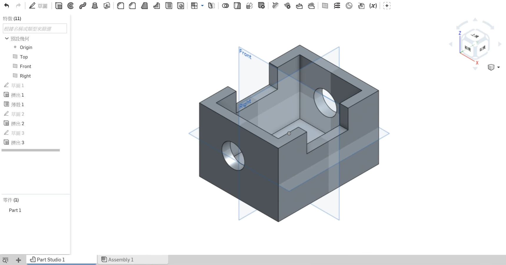

Title: Week 13
Date: 2016-12-09 22:00
Category: Misc
Tags: OnShape(1)
Author: 40423225

上課內容

<!-- PELICAN_END_SUMMARY -->

利用OnShape練習繪製零件。

影片

<iframe src="https://player.vimeo.com/video/198373370" width="640" height="480" frameborder="0" webkitallowfullscreen mozallowfullscreen allowfullscreen></iframe>

<a href="https://vimeo.com/user60053503">個人影片區</a>

心得

今天第十三次上課，又有交一個新的畫圖軟體OnShape，我隨便畫一些範本，但還是不太習慣。回去多練習吧。還有聽說很多人無法更新。我早就處理完了，我太佩服自己了。

