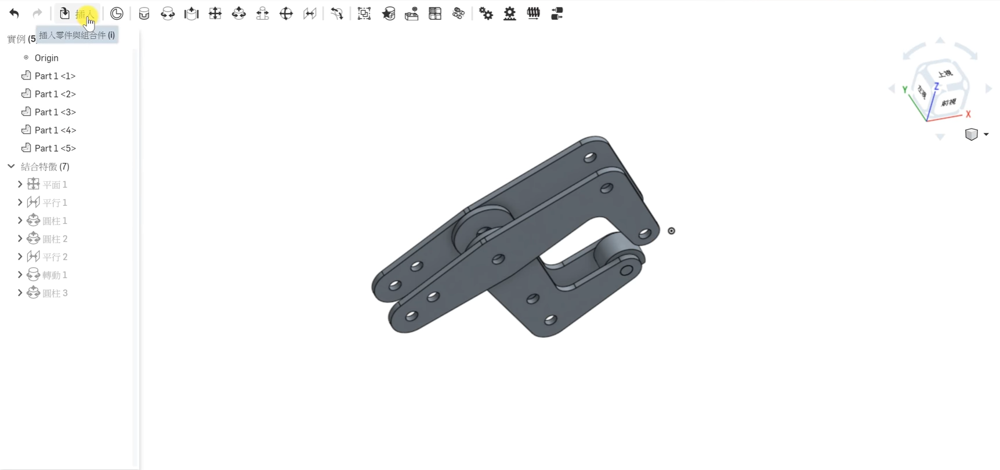
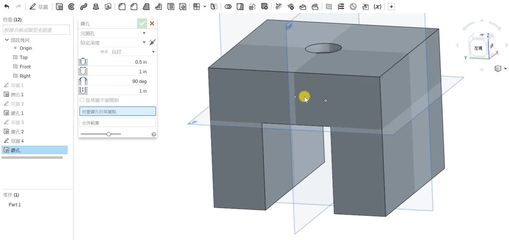

Title: Week 14
Date: 2016-12-16 22:00
Category: Misc
Tags: OnShape(2)
Author: 40423225

上課內容

<!-- PELICAN_END_SUMMARY -->

利用OnShape練習繪製零件並學習如何組立。

心得

今天第十四次上課，上課人數越來越少了，也代表我越來越有機會了。但今天我沒畫完，回家趕工。

